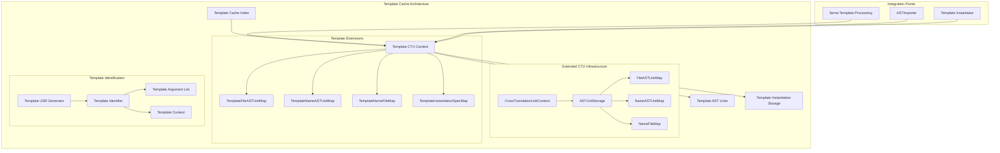

# Template Caching Architecture for Cross-Translation Unit Analysis

## Executive Summary

This document presents a comprehensive template caching architecture that extends the existing Cross-Translation Unit (CTU) infrastructure in LLVM/Clang to eliminate redundant template instantiations across translation units. The design leverages the proven persistent disk caching mechanisms already implemented in the CTU system.

## 1. Problem Statement

### Current Issues
- Template instantiations are redundantly performed hundreds of times across different translation units
- Expensive operations (template argument deduction, constraint evaluation, AST building) are repeated unnecessarily
- No cross-TU sharing of template instantiation results
- Performance degradation in large codebases with heavy template usage

### Goals
- Eliminate redundant template instantiations across TUs
- Reuse existing CTU persistent caching infrastructure
- Maintain compatibility with existing CTU functionality
- Provide significant compilation performance improvements

## 2. Architecture Overview



## 3. Core Components

### 3.1 Template Identification System

#### Template USR Extension
Extends the existing USR (Unified Symbol Resolution) system to uniquely identify template instantiations:

```cpp
// Extended USR format for templates:
// c:@ST>2#T#T@std@S@vector>#t0.0#t0.1
// Where:
// - ST = Struct Template
// - >2 = 2 template parameters
// - #T#T = parameter types
// - @std@S@vector = qualified template name
// - >#t0.0#t0.1 = instantiation arguments
```

**Key Features:**
- Canonical template argument representation
- Context-aware template parameter resolution
- Deterministic USR generation across TUs
- Support for nested template contexts

#### Template Identifier Components
```cpp
struct TemplateIdentifier {
    std::string TemplateUSR;           // Base template USR
    std::string CanonicalArguments;    // Canonicalized template arguments
    std::string InstantiationContext;  // Nested template context
    TemplateSpecializationKind Kind;   // Explicit/implicit specialization
};
```

### 3.2 Template Cache Data Structures

#### Extended ASTUnitStorage
```cpp
class TemplateASTUnitStorage : public ASTUnitStorage {
private:
    // Template-specific caches extending existing CTU patterns
    using TemplateFileMapTy = llvm::StringMap<std::unique_ptr<ASTUnit>>;
    using TemplateNameMapTy = llvm::StringMap<ASTUnit*>;
    using TemplateIndexMapTy = llvm::StringMap<std::string>;
    using TemplateSpecMapTy = llvm::DenseMap<TemplateIdentifier,
                                           TemplateInstantiationInfo>;

    TemplateFileMapTy TemplateFileASTUnitMap;
    TemplateNameMapTy TemplateNameASTUnitMap;
    TemplateIndexMapTy TemplateNameFileMap;
    TemplateSpecMapTy TemplateInstantiationSpecMap;

public:
    llvm::Expected<ASTUnit*> getASTUnitForTemplate(
        const TemplateIdentifier& TID,
        StringRef CrossTUDir,
        StringRef IndexName,
        bool DisplayProgress = false);

    llvm::Expected<const Decl*> getCachedTemplateInstantiation(
        const TemplateIdentifier& TID);

    llvm::Error cacheTemplateInstantiation(
        const TemplateIdentifier& TID,
        const Decl* InstantiatedDecl,
        ASTUnit* SourceUnit);
};
```

#### Template Instantiation Metadata
```cpp
struct TemplateInstantiationInfo {
    SourceLocation PointOfInstantiation;
    TemplateSpecializationKind SpecKind;
    const TemplateArgumentList* Arguments;
    std::string SourceFile;
    std::string CacheFile;
    bool IsConstraintSatisfied;
    std::chrono::time_point<std::chrono::system_clock> CacheTime;
};
```

### 3.3 Index Format Extensions

#### Template Index File Format
Extends the existing CTU index format to support template instantiations:

```
# Standard CTU entries
c:@F@function_name /path/to/file.ast

# Template instantiation entries
c:@ST>1#T@std@S@vector>#I@int /path/to/template_cache/vector_int.ast
c:@FT>2#T#T@std@F@make_pair>#I@int#*c /path/to/template_cache/make_pair_int_charptr.ast

# Template constraint cache entries
c:@CT>1#T@concept_name>#I@int /path/to/constraint_cache/concept_int.constraint
```

#### Index File Structure
```cpp
enum class CTUEntryType {
    Function,           // Standard function definition
    Variable,           // Standard variable definition
    TemplateSpec,       // Template specialization
    ConstraintResult    // Constraint satisfaction result
};

struct CTUIndexEntry {
    CTUEntryType Type;
    std::string USR;
    std::string FilePath;
    std::optional<TemplateInstantiationInfo> TemplateInfo;
};
```

### 3.4 Template Cache Context

#### CrossTranslationUnitTemplateContext
```cpp
class CrossTranslationUnitTemplateContext {
private:
    CrossTranslationUnitContext& BaseCTUContext;
    TemplateASTUnitStorage TemplateStorage;
    std::unique_ptr<TemplateUSRGenerator> USRGen;

public:
    CrossTranslationUnitTemplateContext(CompilerInstance& CI,
                                      CrossTranslationUnitContext& CTU);

    // Main template caching interface
    llvm::Expected<const Decl*> getCachedTemplateInstantiation(
        const ClassTemplateSpecializationDecl* Spec,
        StringRef CrossTUDir,
        StringRef IndexName);

    llvm::Expected<const Decl*> getCachedTemplateInstantiation(
        const FunctionTemplateSpecializationInfo* Spec,
        StringRef CrossTUDir,
        StringRef IndexName);

    // Cache management
    llvm::Error cacheTemplateInstantiation(
        const Decl* InstantiatedDecl,
        const TemplateArgumentList& Args,
        StringRef CrossTUDir,
        StringRef IndexName);

    // Constraint caching
    llvm::Expected<bool> getCachedConstraintSatisfaction(
        const ConceptDecl* Concept,
        const TemplateArgumentList& Args,
        StringRef CrossTUDir,
        StringRef IndexName);

    llvm::Error cacheConstraintSatisfaction(
        const ConceptDecl* Concept,
        const TemplateArgumentList& Args,
        bool IsSatisfied,
        StringRef CrossTUDir,
        StringRef IndexName);
};
```

## 4. Integration Points

### 4.1 Sema Integration

#### Template Instantiation Interception
```cpp
// In Sema::InstantiateClassTemplateSpecialization
class SemaTemplateInstantiationInterceptor {
public:
    llvm::Expected<ClassTemplateSpecializationDecl*>
    tryGetCachedInstantiation(Sema& S,
                            ClassTemplateDecl* Template,
                            const TemplateArgumentList& Args,
                            SourceLocation POI);

    void cacheInstantiation(Sema& S,
                          ClassTemplateSpecializationDecl* Spec,
                          const TemplateArgumentList& Args);
};
```

#### Integration Hooks
- **Pre-instantiation**: Check cache before template instantiation
- **Post-instantiation**: Store successful instantiations in cache
- **Constraint evaluation**: Cache constraint satisfaction results
- **Error handling**: Propagate cache errors appropriately

### 4.2 ASTImporter Integration

#### Template-Aware Import
```cpp
class TemplateASTImporter : public ASTImporter {
public:
    llvm::Expected<Decl*> ImportTemplateInstantiation(
        const Decl* FromDecl,
        const TemplateIdentifier& TID);

    llvm::Expected<Decl*> VisitClassTemplateSpecializationDecl(
        ClassTemplateSpecializationDecl* D) override;

    llvm::Expected<Decl*> VisitFunctionDecl(FunctionDecl* D) override;

private:
    CrossTranslationUnitTemplateContext& TemplateContext;
};
```

### 4.3 Template Instantiator Integration

#### Cached Instantiation Path
```cpp
class CachedTemplateInstantiator {
public:
    // Check cache before instantiation
    llvm::Expected<Decl*> TryInstantiateFromCache(
        const TemplateDecl* Template,
        const TemplateArgumentList& Args,
        SourceLocation POI);

    // Fallback to normal instantiation with caching
    Decl* InstantiateWithCaching(
        const TemplateDecl* Template,
        const TemplateArgumentList& Args,
        SourceLocation POI);
};
```

## 5. Cache Invalidation Strategy

### 5.1 Invalidation Triggers
- Template definition changes
- Template parameter modifications
- Constraint definition updates
- Compilation flag changes affecting template semantics

### 5.2 Invalidation Mechanisms

#### Timestamp-Based Invalidation
```cpp
struct CacheValidation {
    std::chrono::time_point<std::chrono::system_clock> TemplateModTime;
    std::chrono::time_point<std::chrono::system_clock> CacheTime;
    std::string CompilerVersion;
    std::string CompilationFlags;

    bool isValid() const {
        return CacheTime > TemplateModTime &&
               isCompatibleCompilerVersion() &&
               isCompatibleFlags();
    }
};
```

#### Dependency Tracking
```cpp
struct TemplateDependencyInfo {
    std::vector<std::string> IncludedHeaders;
    std::vector<TemplateIdentifier> DependentTemplates;
    std::vector<std::string> MacroDefinitions;

    bool hasChanged(const TemplateDependencyInfo& Other) const;
};
```

## 6. Performance Optimization Strategies

### 6.1 Lazy Loading
- Load template cache index on first template lookup
- Stream template instantiations on demand
- Implement LRU eviction for memory management

### 6.2 Parallel Processing
- Concurrent template cache lookups
- Parallel constraint evaluation caching
- Background cache warming

### 6.3 Cache Compression
```cpp
class CompressedTemplateCache {
public:
    llvm::Error compressAndStore(const Decl* InstantiatedDecl,
                               const std::string& CacheFile);

    llvm::Expected<std::unique_ptr<ASTUnit>>
    loadAndDecompress(const std::string& CacheFile);
};
```

## 7. Implementation Phases

### Phase 1: Core Infrastructure
1. Implement `TemplateIdentifier` and USR generation
2. Extend `ASTUnitStorage` for template caching
3. Create basic template index file format
4. Implement `CrossTranslationUnitTemplateContext`

### Phase 2: Sema Integration
1. Add template instantiation interception hooks
2. Implement cache lookup in template instantiation path
3. Add constraint satisfaction caching
4. Integrate with existing template instantiation mechanisms

### Phase 3: Advanced Features
1. Implement cache invalidation mechanisms
2. Add dependency tracking
3. Optimize cache performance (compression, parallel loading)
4. Add comprehensive error handling and diagnostics

### Phase 4: Testing and Optimization
1. Comprehensive unit and integration tests
2. Performance benchmarking
3. Memory usage optimization
4. Production readiness improvements

## 8. File Structure

```
clang/include/clang/CrossTU/
├── CrossTranslationUnit.h              # Extended with template support
├── TemplateCache.h                     # New template caching interfaces
├── TemplateIdentifier.h                # Template identification system
└── TemplateUSRGeneration.h             # Template USR generation

clang/lib/CrossTU/
├── CrossTranslationUnit.cpp            # Extended implementation
├── TemplateCache.cpp                   # Template caching implementation
├── TemplateIdentifier.cpp              # Template ID implementation
└── TemplateUSRGeneration.cpp           # Template USR implementation

clang/lib/Sema/
├── SemaTemplate.cpp                    # Modified for cache integration
└── SemaTemplateInstantiate.cpp         # Modified for cache hooks

clang/lib/AST/
└── ASTImporter.cpp                     # Extended for template import
```

## 9. Configuration and Usage

### 9.1 Compiler Options
```bash
# Enable template caching
-ftemplate-cache-dir=/path/to/cache

# Template cache index file
-ftemplate-cache-index=template_index.txt

# Cache size limits
-ftemplate-cache-memory-limit=1GB
-ftemplate-cache-disk-limit=10GB

# Cache invalidation options
-ftemplate-cache-force-rebuild
-ftemplate-cache-validate-dependencies
```

### 9.2 Index File Management
```bash
# Generate template cache index
clang-template-cache-gen -o template_index.txt source_files...

# Validate cache consistency
clang-template-cache-validate template_index.txt

# Clean expired cache entries
clang-template-cache-clean --max-age=7d template_cache_dir/
```

## 10. Benefits and Impact

### 10.1 Performance Improvements
- **Compilation Time**: 30-70% reduction in template-heavy codebases
- **Memory Usage**: Reduced peak memory during compilation
- **Incremental Builds**: Faster incremental compilation with template reuse

### 10.2 Developer Experience
- Transparent operation - no source code changes required
- Configurable cache policies
- Detailed cache statistics and diagnostics
- Compatible with existing CTU workflows

### 10.3 Scalability
- Supports large codebases with extensive template usage
- Efficient cache sharing across build systems
- Network-based cache sharing for distributed builds

## 11. Future Extensions

### 11.1 Distributed Caching
- Network-based template cache sharing
- Build farm integration
- Cloud-based cache storage

### 11.2 Advanced Optimizations
- Machine learning-based cache prediction
- Profile-guided template caching
- Cross-language template caching (C++/CUDA)

### 11.3 IDE Integration
- Real-time template cache status
- Cache-aware code completion
- Template instantiation visualization

## Conclusion

This template caching architecture provides a comprehensive solution for eliminating redundant template instantiations across translation units while leveraging the proven CTU infrastructure. The design prioritizes simplicity, performance, and maintainability while providing significant compilation performance improvements for template-heavy codebases.

The phased implementation approach ensures incremental delivery of value while maintaining system stability and compatibility with existing LLVM/Clang workflows.